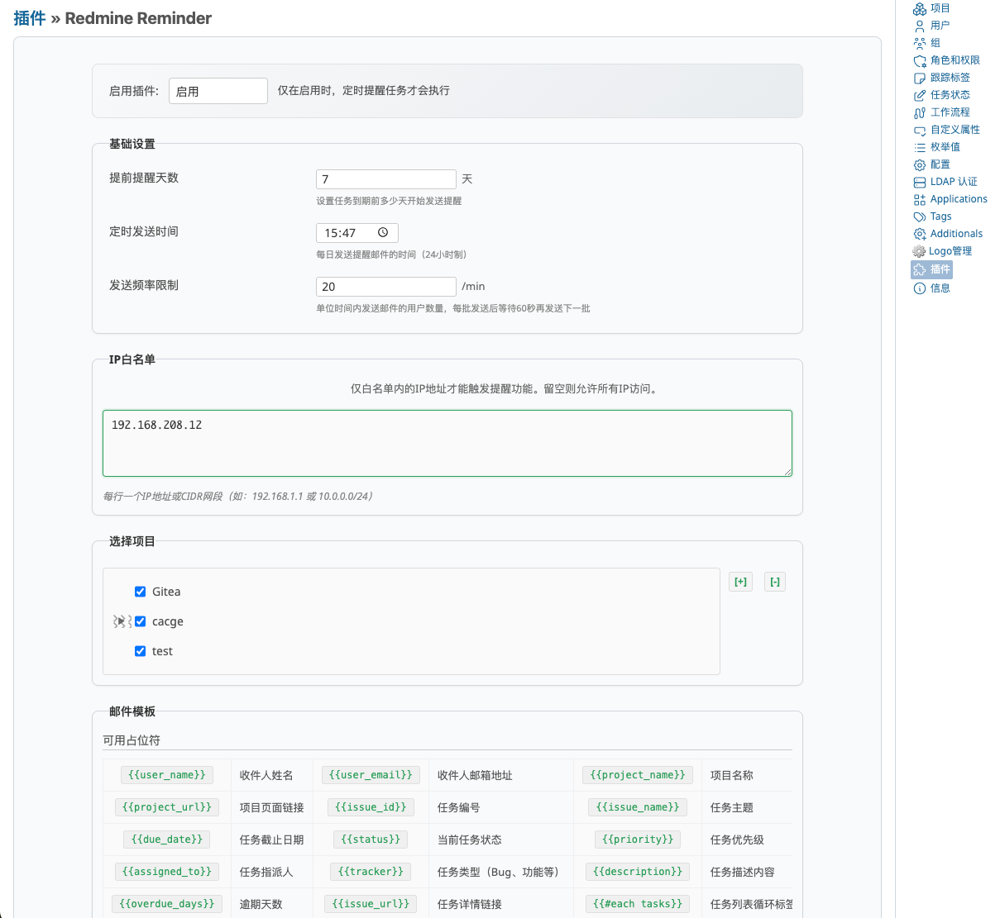
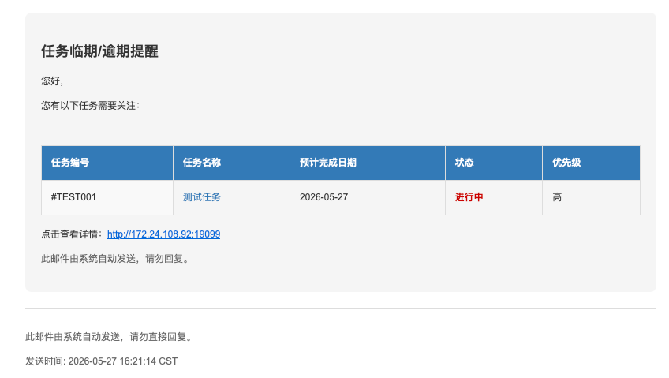

# Redmine Reminder 插件

一个 Redmine 插件，用于自动发送任务临期和逾期的提醒邮件。

## 效果图



## 功能特性

- **定时提醒**：自动向项目成员发送邮件，提醒即将到期或已逾期的任务
- **插件管理集成**：通过 **管理 → 插件 → Redmine Reminder → 配置** 进入设置页面
- **项目选择**：可指定需要监控的项目，或覆盖所有活跃项目
- **邮件模板自定义**：支持占位符语法自定义邮件内容（用户名、任务列表、项目信息等）
- **IP 白名单**：限制仅允许指定 IP 地址或 CIDR 网段触发提醒任务
- **发送频率控制**：限制每批发送的用户数量，避免触发 SMTP 频率限制
- **测试邮件**：支持发送测试邮件以验证 SMTP 配置
- **多语言支持**：支持英文、中文、日文、法文、韩文

## 安装

1. 将插件克隆或复制到 `plugins/redmine_reminder` 目录：

   ```bash
   cd /path/to/redmine/plugins
   git clone <repository-url> redmine_reminder
   ```

2. 重启 Redmine：

   ```bash
   # 开发环境
   bundle exec rails server

   # 生产环境（取决于您的部署方式）
   touch /path/to/redmine/tmp/restart.txt
   ```

3. 无需数据库迁移——插件使用 Redmine 内置的 settings 存储机制。

## 配置

1. 进入 **管理 → 插件**
2. 找到 **Redmine Reminder** 并点击 **配置**
3. 设置以下选项：

| 配置项 | 说明 | 默认值 |
|--------|------|--------|
| 启用插件 | 定时任务的开关 | 启用 |
| 提前提醒天数 | 任务到期前多少天开始发送提醒 | 3 天 |
| 定时发送时间 | 每日发送提醒邮件的时间（24 小时制） | 09:00 |
| 发送频率限制 | 每批发送的用户数（批次间隔 60 秒） | 7 |
| 选择项目 | 需要监控的项目（留空则为所有活跃项目） | 全部 |
| IP 白名单 | 限制触发 IP（每行一个，支持 CIDR） | 允许所有 |
| 邮件模板 | 自定义 HTML 模板（支持占位符） | 默认模板 |

## 调度机制

插件内置后台线程，每分钟检查一次，在设定的**定时发送时间**发送提醒邮件。

也可以使用系统 cron 调用 rake 任务：

```bash
* * * * * cd /path/to/redmine && RAILS_ENV=production bundle exec rake redmine_reminder:send_reminders
```

## 邮件模板占位符

| 占位符 | 说明 |
|--------|------|
| `{{user_name}}` | 收件人姓名 |
| `{{user_email}}` | 收件人邮箱地址 |
| `{{project_name}}` | 项目名称 |
| `{{project_url}}` | 项目页面链接 |
| `{{issue_id}}` | 任务编号 |
| `{{issue_name}}` | 任务主题 |
| `{{due_date}}` | 任务截止日期 |
| `{{status}}` | 当前任务状态 |
| `{{priority}}` | 任务优先级 |
| `{{assigned_to}}` | 任务指派人 |
| `{{tracker}}` | 任务类型 |
| `{{description}}` | 任务描述（截断显示） |
| `{{overdue_days}}` | 逾期天数 |
| `{{issue_url}}` | 任务详情链接 |
| `{{#each tasks}}…{{/each}}` | 任务列表循环 |

## 权限

- `manage_reminder_settings`：访问插件设置所需的权限（建议分配给管理员角色）

## 许可证

MIT

## 作者

carolcoral
