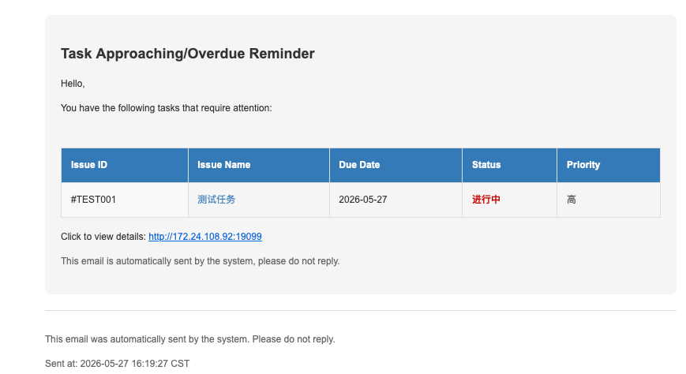
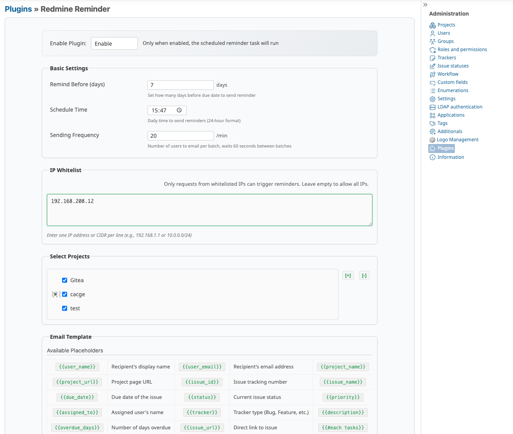

# Redmine Reminder Plugin

A Redmine plugin for automatically sending reminder emails for upcoming and overdue tasks.

## Demo



## Features

- **Scheduled Reminders**: Automatically sends reminder emails to project members for tasks approaching their due date or already overdue
- **Plugin Management Integration**: Settings are accessible via **Administration → Plugins → Redmine Reminder → Configure**
- **Project Selection**: Choose specific projects to monitor, or cover all active projects
- **Email Template Customization**: Customize email content with support for placeholders (user name, task list, project info, etc.)
- **IP Whitelist**: Restrict reminder triggering to specific IP addresses or CIDR ranges
- **Frequency Control**: Limit the number of users per email batch to avoid hitting SMTP rate limits
- **Test Email**: Send a test email to verify SMTP configuration
- **Multi-language**: Supports English, Chinese, Japanese, French, and Korean

## Installation

1. Clone or copy the plugin into `plugins/redmine_reminder`:

   ```bash
   cd /path/to/redmine/plugins
   git clone <repository-url> redmine_reminder
   ```

2. Restart Redmine:

   ```bash
   # For development
   bundle exec rails server

   # For production (depends on your setup)
   touch /path/to/redmine/tmp/restart.txt
   ```

3. No database migration is required — the plugin uses Redmine's built-in settings storage.

## Configuration

1. Go to **Administration → Plugins**
2. Find **Redmine Reminder** and click **Configure**
3. Set your preferences:

| Setting | Description | Default |
|---------|-------------|---------|
| Enable Plugin | Master on/off switch for scheduling | Enabled |
| Remind Before (days) | Days before due date to start reminding | 3 days |
| Schedule Time | Daily time for sending reminders (24h format) | 09:00 |
| Sending Frequency | Max users per batch (60s interval between batches) | 7 |
| Select Projects | Which projects to monitor (empty = all active) | All |
| IP Whitelist | Restrict triggering IPs (one per line, supports CIDR) | Allow all |
| Email Template | Custom HTML template with placeholders | Default template |

## Scheduling

The plugin uses a built-in background thread that checks every minute and sends reminders at the configured **Schedule Time**.

Alternatively, you can use system cron to invoke the rake task:

```bash
* * * * * cd /path/to/redmine && RAILS_ENV=production bundle exec rake redmine_reminder:send_reminders
```

## Email Template Placeholders

| Placeholder | Description |
|-------------|-------------|
| `{{user_name}}` | Recipient's display name |
| `{{user_email}}` | Recipient's email address |
| `{{project_name}}` | Project name |
| `{{project_url}}` | Project page URL |
| `{{issue_id}}` | Issue tracking number |
| `{{issue_name}}` | Issue subject/title |
| `{{due_date}}` | Issue due date |
| `{{status}}` | Current issue status |
| `{{priority}}` | Issue priority level |
| `{{assigned_to}}` | Assigned user's name |
| `{{tracker}}` | Tracker type |
| `{{description}}` | Issue description (truncated) |
| `{{overdue_days}}` | Days overdue |
| `{{issue_url}}` | Direct link to issue |
| `{{#each tasks}}…{{/each}}` | Task list loop |

## Permissions

- `manage_reminder_settings`: Required to access plugin settings (assign to administrator role)

## License

MIT

## Author

carolcoral
